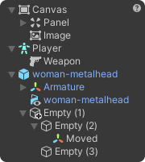
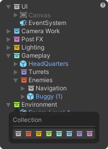
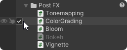
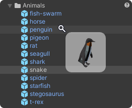

# Smart Hierarchy for Unity
Brings intuitive features and important visual elements in the right place.\
Focused on solving most pain points and improving overall Unity workflow. 

• [📝 Changelog](https://github.com/neon-age/Smart-Hierarchy/wiki/Changelog) 
• [🗺 Roadmap](https://github.com/neon-age/Smart-Hierarchy/projects/1) 
• [💬 Discussions](https://github.com/neon-age/Smart-Hierarchy/discussions)
• [📚 Wiki](https://github.com/neon-age/Smart-Hierarchy/wiki) •

## Installation
Requires Unity **2019.4** or higher.
<details>
<summary>Add from <a href="https://openupm.com/packages/com.av.smart-hierarchy/">OpenUPM</a> <em>| via scoped registry or <a href="https://openupm.com/packages/com.av.smart-hierarchy/#modal-packageinstaller">package installer</a>, recommended</em></summary>
  
&emsp;To add a package via scoped registry:
  
- Open `Edit/Project Settings/Package Manager`
- Add a new Scoped Registry:
  ```
  Name: OpenUPM
  URL:  https://package.openupm.com/
  Scope(s): com.av
  ```
- Open `Window/Package Manager`
- Click <kbd>+</kbd>
- <kbd>Add from Git URL</kbd>
- `com.av.smart-hierarchy` <kbd>Add</kbd>
</details>

<details>
<summary>Add from GitHub | <em>not recommended, no updates </em></summary>
  
- Open `Window/Package Manager`
- Click <kbd>+</kbd>
- <kbd>Add from Git URL</kbd>
- `https://github.com/neon-age/Smart-Hierarchy.git` `#branch-name` <kbd>Add</kbd>

&emsp;Note that you won't be able to receive updates through Package Manager this way, you'll have to update manually.
</details>

Customization is available in `Preferences > Workflow > Smart Hierarchy`.

## Features

### Icons
[](https://github.com/neon-age/Smart-Hierarchy/wiki/Icons)

Most important components are shown to help you orientate visually.\
[Types Priority](https://github.com/neon-age/Smart-Hierarchy/wiki/Icons#types-priority) 
can be defined in Preferences.

### Collections
[](https://github.com/neon-age/Smart-Hierarchy/wiki/Collections)

[Collection](https://github.com/neon-age/Smart-Hierarchy/wiki/Collections) 
is used to organize game-objects in Editor.\
Unlike game-object parent, it does not affect runtime transform hierarchy.
                                                                           


### Activation Toggle
[](https://github.com/neon-age/Smart-Hierarchy/wiki/Activation-Toggle)

Lets you (de)activate game-objects while keeping your selection.

### Hover Preview
[](https://github.com/neon-age/Smart-Hierarchy/wiki/Hover-Preview)


### And more...
- [Activation Swiping](https://github.com/neon-age/Smart-Hierarchy/wiki/Activation-Toggle#swiping)
- [Custom Paste / Duplicate](https://github.com/neon-age/Smart-Hierarchy/wiki/Custom-Paste---Duplicate)
- [Auto Paste as Child](https://github.com/neon-age/Smart-Hierarchy/wiki/Custom-Paste---Duplicate)

## Participation
Feel free to fork / pull request or provide [feedback and ideas](https://github.com/neon-age/Smart-Hierarchy/discussions)!

## Sharing is caring 💗
I want to share my tools with everyone, without hiding behind a paywall.\
If you like my work and feel generous — consider supporting [me](https://twitter.com/_neonage) financially!

[](https://ko-fi.com/L4L02M51R)
[](https://www.patreon.com/neonage?fan_landing=true)


