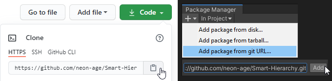
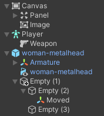
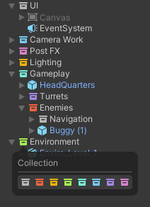
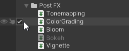
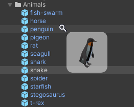

# Smart Hierarchy v0.3.0
Brings intuitive features and important visual elements in the right place.

• [View Changelog](CHANGELOG.md) • [🗺 Roadmap](https://github.com/neon-age/Smart-Hierarchy/projects/1) • [💬 Discussions](https://github.com/neon-age/Smart-Hierarchy/discussions) •

## Installation

Requires Unity **2019.4** or higher.\
Customize plugin in "Preferences > Workflow > Smart Hierarchy".

## Features
### Icons

Most important components are shown to help you orientate visually.\
Types Priority can be defined in Preferences.

### Collections

*"GameObject / Create Collection".*

Collection is used to group objects in Editor without affecting runtime transform hierarchy.\
Children are detached during scene process.

[Best Practices: Transforms Optimization](https://unity.com/ru/how-to/best-practices-performance-optimization-unity#transforms) \
[Best Practices: Optimizing the Hierarchy](https://blogs.unity3d.com/ru/2017/06/29/best-practices-from-the-spotlight-team-optimizing-the-hierarchy/)

**Note:** There is an option in Preferences to keep collections in Playmode.

### Activation Toggle

No more need to select game object in order to (de)activate it.

### Hover Preview

Bindable keys: Alt / Shift / Ctrl.\
**Very Experimental!** Can be enabled in Preferences.

## Participation
Every contribution is highly appreciated — feel free to bug-hunt, provide feedback and ideas!\
Savvy enough to pull a new feature? I'll be happy to review your code and design UX together!

## Sharing is caring
I want to share my tools with everyone, without hiding behind a paywall.\
If you like my work and feel generous — consider supporting me financially!

